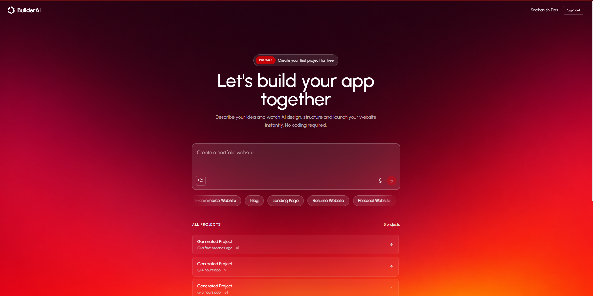
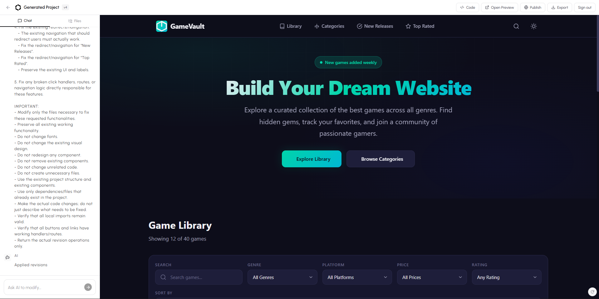

# 🤖 Builder AI — AI-Powered Website Builder

Builder AI is a **prompt-based AI website builder** built with the **MERN stack**. It allows users to describe the website they want using natural language, and the AI generates and modifies the website code based on their prompts.

The project is designed to make website creation easier by allowing users to build websites without manually writing the complete code.

---

## 🚀 Features

* 🤖 **AI-Powered Website Generation**

  * Generate website code from natural-language prompts.
  * Describe what you want and let the AI create the website.

* 💬 **Prompt-Based Editing**

  * Continue chatting with the AI to modify the generated website.
  * Request changes such as colors, layouts, sections, buttons, animations, and more.

* 👀 **Live Website Preview**

  * Preview the generated website while building.
  * See changes as the generated code is updated.

* 📁 **Generated Project Files**

  * Generated website code is organized into project files.
  * Browse and work with the generated files through the builder interface.

* 🛡️ **Code Validation**

  * Generated code goes through validation before being used in the preview.

* 🔐 **Authentication**

  * User authentication and protected project functionality.

* 💾 **Project Management**

  * Create and manage generated projects.
  * Store project information in MongoDB.

* ⚡ **Modern React Interface**

  * Responsive builder interface with dedicated panels for prompting, files, progress, and preview.

* 🌐 **MERN Stack**

  * Full-stack application using MongoDB, Express.js, React, and Node.js.

* 🧠 **OpenRouter AI Integration**

  * AI functionality is currently powered through the OpenRouter API.

---

## 🛠️ Tech Stack

### Frontend

* React.js
* Vite
* JavaScript
* CSS
* React Context API
* Sandpack / Live Preview

### Backend

* Node.js
* Express.js
* MongoDB
* Mongoose
* JWT Authentication

### AI

* OpenRouter API
* AI-powered code generation
* Prompt-based code modification
* Code validation and normalization

### Development Tools

* Git
* GitHub
* VS Code
* npm

---

## 🏗️ Project Architecture

```text
Builder-AI-MERN/
│
├── client/
│   ├── src/
│   │   ├── api/
│   │   ├── components/
│   │   ├── context/
│   │   ├── pages/
│   │   └── App.jsx
│   │
│   └── package.json
│
├── server/
│   ├── config/
│   ├── controllers/
│   ├── middleware/
│   ├── models/
│   ├── routes/
│   ├── services/
│   ├── package.json
│   └── server.js
│
├── .gitignore
└── README.md
```

---

## 🔄 How Builder AI Works

The basic workflow of Builder AI is:

```text
User Prompt
     │
     ▼
React Frontend
     │
     ▼
Backend API
     │
     ▼
AI Service
     │
     ▼
OpenRouter API
     │
     ▼
Generated / Modified Code
     │
     ▼
Code Validation
     │
     ▼
Live Preview
     │
     ▼
User Continues Editing
```

### Example

The user can enter a prompt such as:

```text
Create a modern portfolio website for a software developer
with a dark theme, hero section, skills section,
projects section and contact form.
```

Builder AI processes the request and generates the required website code.

The user can then continue with prompts such as:

```text
Make the hero section more modern.
```

or:

```text
Change the primary color to blue and add animations.
```

The AI can then modify the generated project according to the new instructions.

---

## 📸 Project Screenshots

### Home Page

*Add your home-page screenshot here.*

```text

```

### AI Website Builder

*Add your builder screenshot here.*

```text

```

### Live Preview

*Add your live-preview screenshot here.*

```text

```

> Create a `screenshots` folder in the root directory and place your screenshots there.

---

## ⚙️ Installation

### 1. Clone the Repository

```bash
git clone https://github.com/SnehasishDas30/Builder-AI-MERN-.git
```

```bash
cd Builder-AI-MERN-
```

---

## 📦 Install Frontend Dependencies

```bash
cd client
npm install
```

---

## 📦 Install Backend Dependencies

Open another terminal or return to the root directory:

```bash
cd ../server
npm install
```

---

## 🔐 Environment Variables

Create a `.env` file inside the `server` directory.

Example:

```env
PORT=5000

MONGODB_URI=your_mongodb_connection_string

JWT_SECRET=your_jwt_secret

OPENROUTER_API_KEY=your_openrouter_api_key
```

> Never commit your `.env` file or API keys to GitHub.

---

## ▶️ Running the Project

### Start Backend

From the `server` directory:

```bash
npm run dev
```

or, depending on the scripts configured in `package.json`:

```bash
npm start
```

### Start Frontend

From the `client` directory:

```bash
npm run dev
```

The Vite development server will provide the frontend URL in the terminal.

---

## 🔑 OpenRouter API

Builder AI currently uses **OpenRouter** for its AI functionality.

The OpenRouter API is used to process user prompts and generate or modify website code.

The API key should be stored in the backend environment variables:

```env
OPENROUTER_API_KEY=your_api_key
```

The API key should **never be exposed in the React frontend**.

---

## 🧠 AI Code Generation Pipeline

Builder AI uses multiple backend services to process generated code.

The general pipeline is:

```text
Prompt
  ↓
AI Processing
  ↓
Structured AI Response
  ↓
Content Normalization
  ↓
Code Validation
  ↓
Project Files
  ↓
Live Preview
```

This approach helps keep generated website code structured and suitable for the preview environment.

---

## 🗂️ Main Backend Services

The backend contains services responsible for different parts of the AI workflow.

```text
server/
│
├── services/
│   ├── ai.js
│   ├── aiSchemas.js
│   ├── codeValidator.js
│   ├── contentNormalizer.js
│   ├── diff.js
│   └── prompts.js
```

### `ai.js`

Handles the AI generation workflow and communication with the AI provider.

### `aiSchemas.js`

Defines the expected structure of AI-generated responses.

### `codeValidator.js`

Validates generated code before it is passed to the preview.

### `contentNormalizer.js`

Normalizes generated content into the expected project structure.

### `diff.js`

Handles code differences and modifications between generated versions.

### `prompts.js`

Contains prompt-related logic used by the AI generation system.

---

## 🔒 Security

Important security practices:

* Keep API keys inside environment variables.
* Never expose the OpenRouter API key in frontend code.
* Do not commit `.env` files.
* Use authentication middleware for protected backend routes.
* Validate AI-generated code before rendering it.

---

## 🚧 Future Improvements

Planned improvements for the project include:

* 🌐 Full production deployment
* 🤖 Production-ready OpenRouter integration
* 🚀 One-click website deployment
* 📦 Export generated projects
* 🔗 Custom project URLs
* 🎨 More website templates
* 🧠 Improved AI code generation
* 🔄 Better iterative code editing
* 📱 Improved mobile responsiveness
* ⚡ Performance optimizations
* 📊 Project usage analytics

---

## 🌍 Deployment

The project is currently being prepared for production deployment.

The planned production architecture will contain:

```text
React Frontend
      │
      ▼
Production Backend
      │
      ├── MongoDB
      │
      └── OpenRouter API
```

Production environment variables will be configured separately from local development.

---

## 👨‍💻 Author

**Snehasish Das**

GitHub:
https://github.com/SnehasishDas30

---

## ⭐ Support

If you find this project useful, consider giving the repository a ⭐ on GitHub.

---

## 📄 License

This project is currently intended as a personal/project portfolio application.
